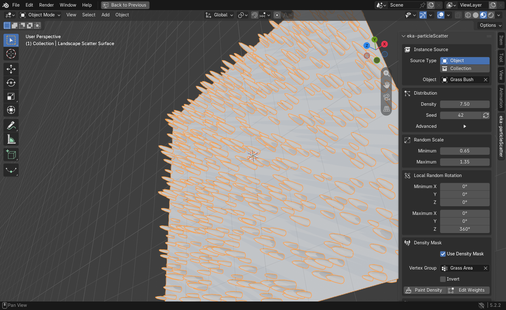
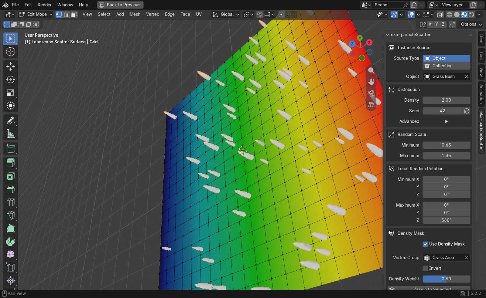

# eka-particleScatter

eka-particleScatter is a Blender 4.2+ add-on for scattering an object, or random objects from a collection, across a mesh. It creates a nondestructive Geometry Nodes modifier and uses instances by default for efficient Eevee and Cycles rendering.

## Interface

## Features

- Surface density and repeatable random seed
- One-click generation of a new seed pattern
- Optional minimum point spacing to reduce clumps and overlap
- Adjustable surface-normal offset to prevent buried instances
- Independent viewport density percentage for responsive editing
- Uniform random scale range
- Independent local X, Y, and Z rotation ranges
- Automatic alignment to the target surface normals
- Single-object or random collection instancing
- Continuous red-to-blue density mask with Weight Paint and Edit Mode controls
- Independent viewport and render visibility
- Optional original surface output and instance realization
- In-place node-graph upgrades without duplicate modifiers

## Install

1. Use `dist/eka-particleScatter-1.2.0.zip`.
2. In Blender, open **Edit > Preferences > Add-ons**.
3. Open the menu and choose **Install from Disk**, then select the ZIP.
4. Enable **eka-particleScatter** if Blender does not enable it automatically.

## Use

1. Select the mesh that should receive the scatter.
2. Open the 3D Viewport sidebar with `N`, then choose the **eka-particleScatter** tab.
3. Pick one source object or a source collection.
4. Set density, seed, scale, and rotation ranges.
5. Click **Add Scatter**. Later changes update the modifier immediately.

Open **Advanced** under Distribution to reduce **Viewport Density** without changing final-render density, enforce a **Minimum Distance** between points, or move instances away from the mesh with **Surface Offset**. The refresh button beside **Seed** generates another deterministic layout.

## Density Mask

Enable **Use Density Mask** to multiply the main **Density** value by a vertex weight at every point on the surface:

- Red / weight 1 uses the full density.
- Green and yellow / intermediate weights use partial density.
- Blue / weight 0 produces no scattered points.

For smooth gradients, click **Paint Density** and paint with Blender's Weight Paint brush. Click **Finish Painting** when done.

For precise mesh regions, click **Edit Weights**. Select vertices, edges, or faces in Edit Mode, set **Density Weight**, then click **Assign to Selected**. The **Blue 0**, **Mid 0.5**, and **Red 1** buttons provide quick values. Click **Finish Editing** when done. **Invert** swaps high- and low-density areas.

## Rendering Notes

- Source materials are preserved and work in Eevee and Cycles.
- Instances stay lightweight unless **Realize Instances** is enabled.
- **Realize Instances** can use substantial memory on dense scatters; keep it disabled unless real geometry is required.
- The add-on does not change the scene's render engine, color management, lighting, or output settings.
- Put source objects in a hidden collection if they should not appear separately in the final render.
- Place each source object's origin where it should touch the surface and apply its scale for predictable sizing.
